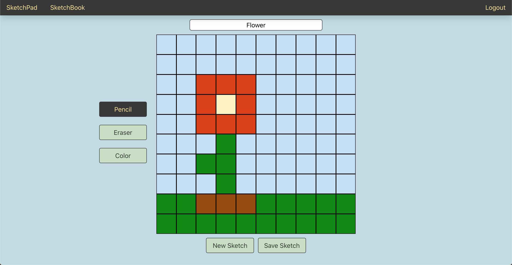

# SketchBook
SketchBook is an app that gives users a creative outlet by allowing users to design and edit drawings made on the app. SketchBook is a fun alternative to pen and paper for the average doodler.

## SketchPad
Once the user inputs the desired size of the sketch, the "SketchPad" page is where users are able to design their sketch by drawing, erasing, and choosing various colors. Users are also able to save the sketch to their "SketchBook".

## SketchBook
On the "SketchBook" page, users are able to view all of their drawings as well as edit or delete them individually. 

